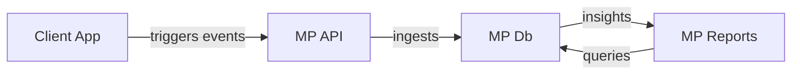
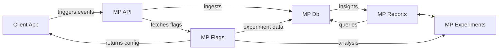

# 🔧 FixPanel 

Welcome to **FixPanel**, a modern, React + Next.js + Tailwind demo site for a fictional finance company. It showcases the power of [Mixpanel’s SDKs](https://docs.mixpanel.com/docs/tracking-methods/sdks/javascript) and core capabilities implemented in a modern web app. 

In particular, Fixpanel can power demos for:

- **Auto-capture**: track clicks, page views, and form interactions out-of-the-box.
- **Feature flagging**: roll out, test, and target content variants in real time.
- **Session replay**: record user sessions and replay to understand user behavior.
- **Custom event tracking**: fire manual events + profile updates, and A/B test experiments.
- **Console debug messages**: Beginner-friendly prompts in the browser console guiding you through Mixpanel features.

You can run Fixpanel on your local, or use the hosted version:

- [Live Site](https://ak--47.github.io/fixpanel/)
- [Mixpanel Project](https://mixpanel.com/project/3276012/view/3782804/app/events)
- [Internal Docs](https://www.notion.so/mxpnl/Fixpanel-1ece0ba9256280b9b10ad1ad09b80bca)

---

## Prerequisites

Before you begin, make sure you have:

- [**Node.js**](https://nodejs.org/en/download) (v16 or later) and **npm** installed on your machine.
- Access to this [**Mixpanel project**](https://mixpanel.com/project/3276012/view/3782804/app/home)

---

## Getting Started

### Clone the Repository

```bash
git clone https://github.com/ak--47/fixpanel.git
cd fixpanel
```

### Install Dependencies

```bash
npm install
```

This will install all necessary packages, including Next.js, React, and the Mixpanel browser SDK.

### Configure Mixpanel (optional)

This app is automatically configured to send data to [this Mixpanel project](https://mixpanel.com/project/3276012/view/3782804/app/home)

To set up your own Mixpanel project, follow these steps:

1. Create a .env file in the root of the project:

   ```bash
   touch .env
   ```

2. Open `.env` and add the following: 

   ```dotenv
   REACT_APP_MIXPANEL_TOKEN=YOUR_MIXPANEL_TOKEN
   ```
   replacing `YOUR_MIXPANEL_TOKEN` with your Mixpanel project token. You can find this in your Mixpanel project settings.


### Run the Dev Server

```bash
npm run dev
```

Now open [http://localhost:3000](http://localhost:3000) in your browser. 

You should see the FixPanel homepage.

---

## Building for Production

To create an optimized production build and start the app:

```bash
npm run build
npm start
```

By default, Next.js serves a static shell; all routing and tracking happen client-side.

---

## Feature Walkthrough

### Auto-Capture

- Out-of-the-box, clicks, form submissions, and page views are logged to Mixpanel automatically.
- Inspect your DevTools console: you’ll see helper messages and event names as you interact.

### Feature Flags

- The homepage banner is controlled by a Mixpanel feature flag (`exp_customerStory`).
- Code lives in `components/Modal.tsx` showing how to fetch and apply flag data.

### Session Replay

- Enable session replay in your Mixpanel project settings.
- All user sessions on this demo site will be recorded (respecting GDPR/consent if configured).
- Replay sessions directly in the Mixpanel UI to watch user journeys.


### Console Helpers

- The app logs useful tips in `console.info()` and `console.warn()` to guide non-developers through the code.
- Look for messages like `"[MIXPANEL]: <<something happened>>` to confirm your setup.

---

## Client-Side Routing

This is a Next.js client-component-only shell. All navigation is handled via `next/link` and the `useRouter` hook:

```tsx
import Link from 'next/link';
import { useRouter } from 'next/navigation';

// Example Link:
<Link href="/about">About Us</Link>

// Programmatic navigation:
const router = useRouter();
router.push('/testimonials');
```

Since the site is prebuilt as a static shell, page loads are near-instant.

---

## Customizing the Demo

- **Swap themes**: Edit Tailwind colors in `tailwind.config.js`.
- **Add new flags**: Define new experiments in Mixpanel and fetch via `mixpanel.flags.get_feature_data()`.
- **Track new events**: Use `mixpanel.track('Event Name', { property: 'value' });` anywhere in the code.
- **Add pages**: Create new files under `/app` to expand navigation.


---


## Feature Flagging Architecture


This is the typical flow of data from a client application to Mixpanel's APIs, database, and analytical reports:



Feature-flagging significantly extends this pattern by allowing Mixpanel to supply bespoke configuration data back to the client app. Configuration data is used to control the behavior of the client app, (such as which features are enabled or disabled for a given user), and also is pushed back into Mixpanel for analysis in all core reports as well as a (new!) experiments report:


[docs](https://www.notion.so/mxpnl/Feature-Flagging-Beta-Documentation-1e0e0ba925628046a590ff15a351e74b?pvs=26&qid=)